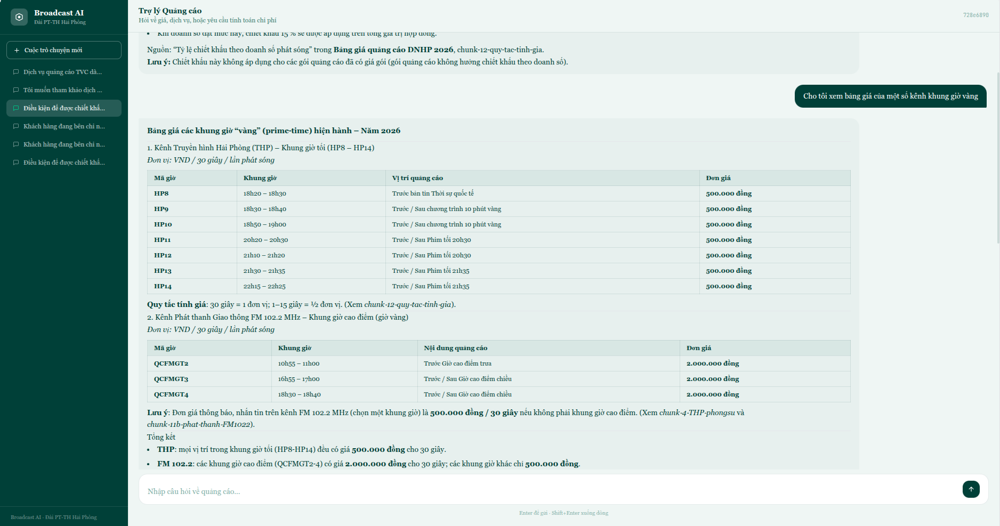

# Broadcast AI — AI Assistant for Advertising & Business Department

> Hai Phong Radio and Television Station (BPTTH)

An AI-powered chat assistant that helps the Advertising & Business Department look up pricing, calculate advertising costs, and get instant answers from internal documents — without digging through PDFs manually.

---

 


## The Problem

The Advertising & Business Department at BPTTH works with multiple overlapping price tables (THP, HP channels, radio, digital, documentaries), each governed by separate official decisions (QĐ 413, 414, 415). Staff regularly need to:

- Find the right unit price for a given time slot and customer type
- Calculate total contract costs including discounts
- Determine which pricing decision applies (Hai Phong client vs. out-of-province)

Doing this manually is slow and error-prone, especially under client pressure.

---

## The Solution

A conversational AI assistant backed by a **Knowledge Graph** built from the station's actual documents. Instead of keyword search, the system understands *intent* and retrieves *contextually relevant* information.

**Two modes:**
- **Q&A mode** — answers pricing and policy questions with source citations
- **Calculate mode** — computes exact costs using dedicated Python pricing tools (LLM handles presentation, not arithmetic)
- **Quote mode** - In Progressing..

---

## How It Works

```
User message
    │
    ├── Intent classifier  →  "qa" or "calculate"
    │
    ├── GraphRAG Hybrid Retrieval (runs in parallel)
    │     ├── Vector search (semantic similarity)
    │     ├── Graph traversal (entity relationships)
    │     └── Fulltext search (keyword matching)
    │
    ├── "qa"         → LLM generates answer from retrieved context
    └── "calculate"  → LLM calls Python pricing tools → formats result
```

### Knowledge Base (Neo4j)

The core of the system. Source documents are processed into a **Knowledge Graph** where:
- Text is split into chunks and embedded with a Vietnamese embedding model
- Entities (time slots, prices, channels, customer types) and their relationships are extracted by an LLM
- Three indexes enable hybrid search: vector, fulltext, and entity-level

Built with a **customized version of [Neo4j LLM Graph Builder](https://neo4j.com/labs/genai-ecosystem/llm-graph-builder/)**, adapted for Vietnamese and BPTTH-specific content.

### GraphRAG Hybrid

Results from all three search strategies are merged and re-ranked. Chunks that appear in multiple search types (e.g., both vector and fulltext) are ranked higher — improving answer precision for domain-specific terms like slot codes (HP8, T1, S3).

---

## Stack

| Layer | Technology |
|-------|-----------|
| Backend | Python, FastAPI, LangGraph |
| LLM | Viettel AI API |
| Embedding | `AITeamVN/Vietnamese_Embedding_v2` (self-hosted via Infinity) |
| Knowledge Graph | Neo4j (AuraDB) |
| Frontend | React, Vite, TypeScript, Tailwind CSS |

---

## Project Structure

```
broadcast-AI-application/
├── backend/
│   ├── main.py                        # FastAPI entry point
│   └── app/
│       ├── api/routes/
│       │   ├── chat.py                # POST /api/chat, /stream, session routes
│       │   └── health.py              # GET /health
│       ├── config/
│       │   ├── settings.py            # Pydantic settings — reads backend/.env
│       │   └── constants.py           # Cypher retrieval queries, LLM prompts, search params
│       ├── graph/                     # LangGraph workflow
│       │   ├── state.py               # ChatState definition
│       │   ├── nodes.py               # Node functions (load_session, classify, retrieve, generate, ...)
│       │   ├── edges.py               # Conditional routing logic
│       │   └── workflow.py            # Graph compilation + invoke_graph()
│       ├── schemas/
│       │   └── chat.py                # Pydantic request / response models
│       └── services/
│           ├── retriever.py           # GraphRAG Hybrid search (vector + graph + fulltext)
│           ├── llm.py                 # LLM singleton (Viettel AI)
│           ├── session.py             # Neo4j session CRUD
│           ├── pricing_tools.py       # Python pricing calculators (pure functions)
│           └── tools.py               # LangChain StructuredTool wrappers
│
├── frontend/
│   └── src/
│       ├── components/
│       │   ├── ChatInput.tsx          # Input box + send button
│       │   ├── Message.tsx            # Message bubble with citations + KaTeX math
│       │   └── Sidebar.tsx            # Session list panel
│       ├── pages/
│       │   └── ChatPage.tsx           # Main chat page
│       ├── hooks/                     # Custom React hooks
│       ├── types/                     # TypeScript type definitions
│       └── lib/                       # Shared utilities
│
├── benchmark/
│   └── run.py                         # RAGAS evaluation benchmark
├── models/
    └── local_model_AITeamVN_Vietnamese_Embedding_v2/   # Local embedding model
```

---

## Quick Start

**Requirements:** Python ≥ 3.10, Node.js ≥ 18, pnpm, uv, Docker, Neo4j with APOC

```bash
# 1. Install dependencies
uv sync
cd frontend && pnpm install && cd ..

# 2. Configure environment
cp backend/.env.example backend/.env   # fill in NEO4J_*, INFINITY_URL, VIETTEL_*

# 3. Start embedding server
docker run -d -p 7997:7997 --gpus all \
  -v ./models/local_model_AITeamVN_Vietnamese_Embedding_v2:/models/Vietnamese_Embedding_v2 \
  michaelf34/infinity:latest v2 \
  --model-id /models/Vietnamese_Embedding_v2 --port 7997

# 4. Build the Knowledge Base
# Upload documents via Neo4j LLM Graph Builder → point to your Neo4j instance

# 5. Run backend
PYTHONPATH=backend uv run uvicorn backend.main:app --reload --port 8000

# 6. Run frontend
cd frontend && pnpm dev   # http://localhost:5173
```

---

## API

| Endpoint | Method | Description |
|----------|--------|-------------|
| `/api/chat` | POST | Chat (full response) |
| `/api/chat/stream` | POST | Chat with SSE token streaming |
| `/api/sessions` | GET | List conversation sessions |
| `/api/sessions/{id}` | DELETE | Delete a session |
| `/health` | GET | Health check |

---

## Benchmark

Evaluated 4 retrieval strategies on **50 custom test questions** using [RAGAS](https://docs.ragas.io/) metrics.

| Retrieval Mode | Median Latency | Mean Latency | Answer Relevancy | Context Precision | Context Recall | Faithfulness |
|----------------|---------------|-------------|-----------------|------------------|---------------|-------------|
| Fulltext only | 146ms | 149ms | 0.649 | 1.000 | 1.0 | 1.0 |
| Vector only | 2,032ms | 2,695ms | 0.789 | 1.000 | 1.0 | 1.0 |
| Graph + Vector | 1,406ms | 1,961ms | 0.855 | 1.000 | 1.0 | 1.0 |
| **Graph + Vector + Fulltext**   | **1,523ms** | **1,839ms** | **0.884** | **1.000** | **1.0** | **1.0** |

**Key takeaways:**
- **Hybrid (Graph + Vector + Fulltext)** achieves the highest answer relevancy (+11.9% over vector-only) while being ~25% faster at median latency
- **Fulltext-only** is fastest but has the lowest relevancy — poor at semantic queries
- **Context Precision / Recall / Faithfulness** are near-perfect across all modes, meaning retrieved chunks are always relevant and answers stay grounded

> **Design decision:** The hybrid mode adds ~1.4s over fulltext-only — a deliberate trade-off for significantly higher answer relevancy. At ~1.5s median retrieval latency, the UX remains responsive and acceptable for a domain-specific internal tool.

*Internal use — Hai Phong Radio and Television Station · v0.1.0 · April 2026*
